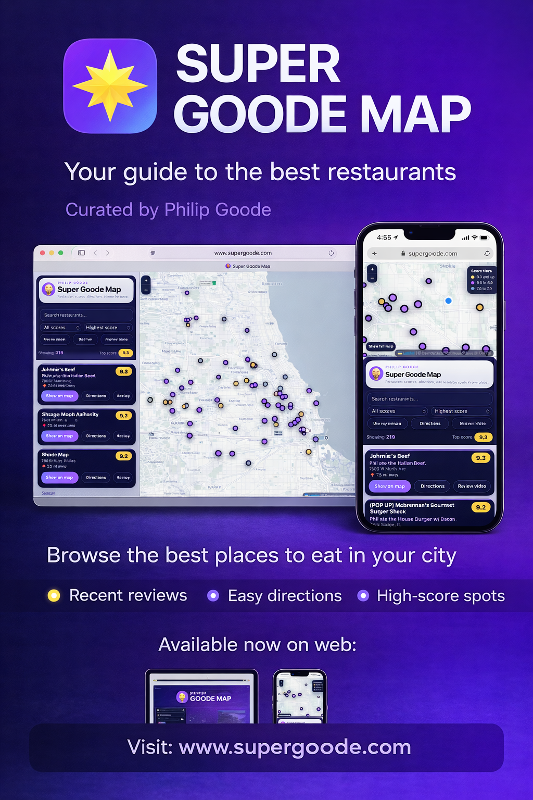

# Super Goode Web Map

Static restaurant map for Phil Goode's reviews, built as a GitHub Pages site with no backend.

  

## Overview

The site turns Phil Goode's review posts into a browsable map and list experience. Visitors can search restaurants, filter by score, sort results, open review videos, launch directions, and browse nearby spots on desktop or mobile.

## Current Project State

As of 2026-03-28, the live web-map dataset contains 220 restaurants sourced from [`data/locations.json`](/Users/anthonylarosa/CODEX/Super Goode/data/locations.json).

- 19 restaurants score 9.0 or higher
- 141 restaurants score in the 8.x range
- 60 restaurants score in the 7.x range
- 220 of 220 restaurants currently have coordinates, subtitles, review URLs, and directions URLs

The current data model is:

- Source of truth: [`data/locations.json`](/Users/anthonylarosa/CODEX/Super Goode/data/locations.json)
- Compatibility mirror: [`locations.json`](/Users/anthonylarosa/CODEX/Super Goode/locations.json)
- CSV export: [`super_goode_locations.csv`](/Users/anthonylarosa/CODEX/Super Goode/super_goode_locations.csv)
- Embedded fallback snapshot: [`index.html`](/Users/anthonylarosa/CODEX/Super Goode/index.html)

The site first tries to load `./data/locations.json`, then falls back to `./locations.json`, and finally falls back to the embedded snapshot in `index.html` if shared JSON cannot be loaded.

## What The Site Does

- Renders restaurants on a Leaflet map with score-tier pin colors
- Shows a scrollable card list with score, subtitle, address, and actions
- Supports restaurant search across names and subtitles
- Filters by score and sorts by highest score, lowest score, A to Z, or nearest to the user
- Supports current-location lookup, nearby-only filtering, and fit-to-results map behavior
- Opens review videos in a new tab and directions in Google Maps
- Includes a mobile-specific full-map toggle for small screens

## Data Workflow

### Manual Intake

Use [`admin/add-review.html`](/Users/anthonylarosa/CODEX/Super Goode/admin/add-review.html) when adding a restaurant by hand.

1. Open the admin helper.
2. Enter the review details.
3. Copy the generated JSON object.
4. Paste it into [`data/new-reviews.json`](/Users/anthonylarosa/CODEX/Super Goode/data/new-reviews.json).
5. Run `node scripts/update_locations.js`.
6. Run `node scripts/refresh_static_artifacts.js`.
7. Review the diff, then commit and push.

### Google Sheet / Form Sync

The repo also supports approved-row intake from a published Google Sheet CSV.

1. Publish the sheet as CSV.
2. Store the CSV URL in the `GOOGLE_SHEET_CSV_URL` GitHub secret.
3. Run the workflow in [`.github/workflows/sync-sheet.yml`](/Users/anthonylarosa/CODEX/Super Goode/.github/workflows/sync-sheet.yml) manually or let the hourly schedule run.
4. The workflow keeps only approved rows, blocks obvious test entries, geocodes missing coordinates when possible, writes the shared JSON files, and commits the updated data back to the repo.

## Static Artifact Refresh

Run `node scripts/refresh_static_artifacts.js` whenever the source dataset changes and you want the repo artifacts to match it.

That command currently:

- rewrites [`locations.json`](/Users/anthonylarosa/CODEX/Super Goode/locations.json) from [`data/locations.json`](/Users/anthonylarosa/CODEX/Super Goode/data/locations.json)
- rebuilds [`super_goode_locations.csv`](/Users/anthonylarosa/CODEX/Super Goode/super_goode_locations.csv)
- preserves the existing CSV header structure, including export-only columns
- keeps one row per restaurant and leaves unmatched export-only fields blank
- refreshes the embedded fallback dataset inside [`index.html`](/Users/anthonylarosa/CODEX/Super Goode/index.html)

## Repository Structure

- [`index.html`](/Users/anthonylarosa/CODEX/Super Goode/index.html): the static web app UI and embedded fallback snapshot
- [`data/locations.json`](/Users/anthonylarosa/CODEX/Super Goode/data/locations.json): canonical web-map dataset
- [`locations.json`](/Users/anthonylarosa/CODEX/Super Goode/locations.json): required compatibility mirror
- [`super_goode_locations.csv`](/Users/anthonylarosa/CODEX/Super Goode/super_goode_locations.csv): export of the current dataset with preserved legacy columns
- [`admin/add-review.html`](/Users/anthonylarosa/CODEX/Super Goode/admin/add-review.html): manual intake helper
- [`scripts/update_locations.js`](/Users/anthonylarosa/CODEX/Super Goode/scripts/update_locations.js): merge intake into the canonical dataset
- [`scripts/sync_sheet.js`](/Users/anthonylarosa/CODEX/Super Goode/scripts/sync_sheet.js): download and sanitize approved sheet rows
- [`scripts/location_enrichment.js`](/Users/anthonylarosa/CODEX/Super Goode/scripts/location_enrichment.js): geocode and directions enrichment helpers
- [`scripts/refresh_static_artifacts.js`](/Users/anthonylarosa/CODEX/Super Goode/scripts/refresh_static_artifacts.js): mirror, CSV, and fallback refresh

## Hosting And Deployment

This project is hosted as a static GitHub Pages site from the repository itself.

- No build step
- No backend
- No database
- Data changes publish through committed static files
- GitHub Actions is used for sheet ingestion, not for running a separate app server
