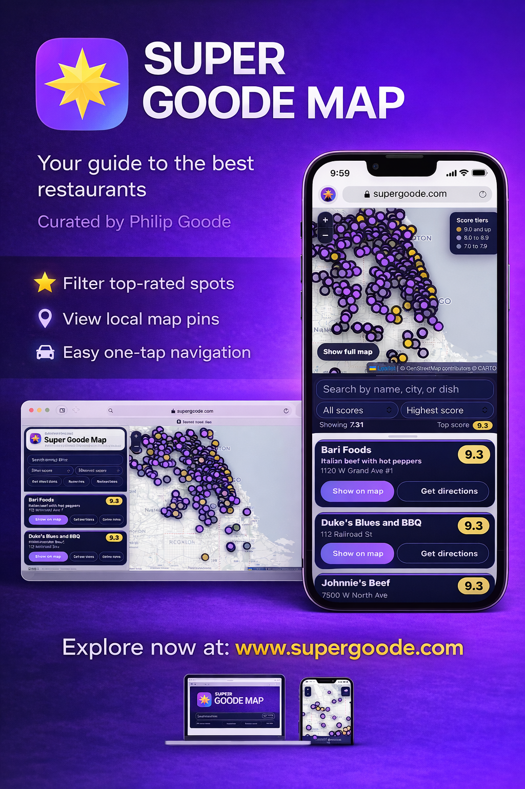

# Super Goode Web Map

Static restaurant map for Phil Goode's reviews, built as a GitHub Pages site with no backend.

  

## Overview

The site turns Phil Goode's review posts into a browsable restaurant map and list that works on desktop and mobile. Visitors can search by restaurant name, city, or dish, filter by score, sort results, watch review videos, and tap `Get directions` to open Google Maps.

## Current Project State

As of 2026-04-09, the canonical web-map dataset in [`data/locations.json`](/Users/anthonylarosa/CODEX/Super Goode/data/locations.json) contains 432 restaurants.

- 35 restaurants score 9.0 and up
- 284 restaurants score in the 8.x range
- 112 restaurants score in the 7.x range
- 1 restaurant currently scores below 7.0
- 432 of 432 restaurants currently have coordinates
- 432 of 432 restaurants currently have subtitles and review URLs
- 431 of 432 restaurants currently have a populated `googlePlaceUrl`
- 254 of 432 restaurants currently keep a stored `directionsUrl`
- 1 row intentionally leaves `googlePlaceUrl` blank and falls back to `directionsUrl`: `Dorrie's Kitchen`
- Source types currently break down to 427 `structured-data` rows and 5 `sheet` rows
- Recent data-pipeline fixes now keep same-name different-address locations separate during sheet sync, and the latest coordinate cleanup corrected the stored map point for `Pupusería Rinconcito Hispano`

Current source-of-truth layout:

- Canonical dataset: [`data/locations.json`](/Users/anthonylarosa/CODEX/Super Goode/data/locations.json)
- Required mirror: [`locations.json`](/Users/anthonylarosa/CODEX/Super Goode/locations.json)
- CSV export: [`super_goode_locations.csv`](/Users/anthonylarosa/CODEX/Super Goode/super_goode_locations.csv)
- Embedded fallback snapshot: [`index.html`](/Users/anthonylarosa/CODEX/Super Goode/index.html)

The app first tries `./data/locations.json`, then falls back to `./locations.json`, and finally uses the embedded snapshot in `index.html` if the shared JSON files cannot be loaded.

## What The Site Does Now

- Renders restaurant pins on a Leaflet map with score-tier colors
- Shows a card list with score, subtitle, address, review link, and map actions
- Searches across restaurant name, city, and dish or subtitle text
- Supports case-insensitive normalized matching for search terms
- Filters by score and sorts by highest score, lowest score, A to Z, or nearest to the user
- Uses `Get directions` with the current priority: `googlePlaceUrl` -> `directionsUrl` -> generated Google Maps fallback
- Opens review videos in a new tab
- Includes a true mobile full-map mode with `Show full map` / `Show list`

## Mobile Experience

The current mobile web layout is intentionally map-first and compact:

- white top branding bar with the current headshot and logo assets
- shorter map block for better search and results visibility
- on-map overlay `Fit` and `Locate` buttons
- dark controls block for search, score filter, and sort
- white scrolling results area with dark restaurant cards

Important mobile behavior details:

- the on-map `Locate` button recenters and zooms to the user's location only
- it does not turn on nearby filtering or reduce the visible result count
- the desktop controls still keep the larger inline location buttons

## Analytics

Google Analytics 4 is now installed directly in [`index.html`](/Users/anthonylarosa/CODEX/Super Goode/index.html) with a guarded helper so blocked analytics requests do not break the site.

The current custom events are:

- `watch_review_click`
- `directions_click`
- `locate_click`
- `fit_pins_click`
- `restaurant_pin_open`
- `restaurant_card_open`
- `search_used`
- `score_filter_changed`

The current wiring tracks the real UI surfaces in the live web map:

- review clicks from cards and map popups
- directions clicks from cards and map popups
- mobile overlay `Locate` and `Fit`
- desktop locate and fit controls
- map popup opens
- card `Show on map` actions
- debounced search usage
- score filter changes

## Data Model

The canonical JSON dataset currently uses:

- `name`
- `score`
- `subtitle`
- `address`
- `city`
- `state`
- `lat`
- `lng`
- `googlePlaceUrl`
- `directionsUrl`
- `reviewUrl`
- `sourceType`
- `confidence`
- `notes`

`googlePlaceUrl` is now the preferred Google Maps field. `directionsUrl` remains the stored fallback when present, and the UI still generates a final Google Maps fallback at runtime when needed.

## Intake And Sync Workflow

### Manual Intake

Use [`admin/add-review.html`](/Users/anthonylarosa/CODEX/Super Goode/admin/add-review.html) to generate a valid JSON snippet for a new restaurant.

1. Enter the restaurant details in the helper.
2. Include `googlePlaceUrl` when a real Google Maps place or share URL is available.
3. Keep `directionsUrl` as the fallback field when needed.
4. Paste the generated object into [`data/new-reviews.json`](/Users/anthonylarosa/CODEX/Super Goode/data/new-reviews.json).
5. Run `node scripts/update_locations.js`.
6. Run `node scripts/refresh_static_artifacts.js`.
7. Review the diff, then commit and push.

### Google Sheet Sync

The repo also supports approved-row intake from a published Google Sheet CSV, including the current Google Form workflow that now sends both additions and removals through the same sheet.

1. Publish the sheet as CSV.
2. Store the CSV URL in the `GOOGLE_SHEET_CSV_URL` GitHub secret.
3. Run [`.github/workflows/sync-sheet.yml`](/Users/anthonylarosa/CODEX/Super Goode/.github/workflows/sync-sheet.yml) manually or let the hourly schedule run.
4. Set `Request Type` to `Add location` for normal add/update intake, or `Remove location` for exact-location removals.
5. The workflow filters to approved rows, blocks obvious temporary add entries, accepts optional Google Maps place/share URL headers, geocodes missing coordinates when possible, writes the shared JSON files, refreshes the CSV and embedded fallback snapshot, and commits the updated data back to the repo.

Removal safety rules:

- same-name restaurants at different addresses are treated as different locations
- remove requests only delete an exact matched location
- remove matching prefers review URL first, then exact name + address + city + state, then tight coordinate match
- a remove row will not delete every location for a chain or same-brand restaurant name

Supported place-link header variants include:

- `Google Maps URL`
- `Google Place URL`
- `Google Maps Place URL`
- `Place URL`
- `Maps URL`

## Refreshing Static Artifacts

Run `node scripts/refresh_static_artifacts.js` whenever [`data/locations.json`](/Users/anthonylarosa/CODEX/Super Goode/data/locations.json) changes.

That refresh keeps these files aligned:

- [`locations.json`](/Users/anthonylarosa/CODEX/Super Goode/locations.json)
- [`super_goode_locations.csv`](/Users/anthonylarosa/CODEX/Super Goode/super_goode_locations.csv)
- the embedded `DATA` snapshot in [`index.html`](/Users/anthonylarosa/CODEX/Super Goode/index.html)

The sheet-sync workflow now uses that same refresh path before committing, so approved add and remove requests can keep the JSON mirror, CSV export, and embedded fallback snapshot in sync automatically.

The CSV export keeps its existing header order and legacy columns while still exporting current dataset fields like `googlePlaceUrl`.

## Repository Structure

- [`index.html`](/Users/anthonylarosa/CODEX/Super Goode/index.html): static app shell, mobile and desktop UI, and embedded fallback data
- [`data/locations.json`](/Users/anthonylarosa/CODEX/Super Goode/data/locations.json): canonical dataset
- [`locations.json`](/Users/anthonylarosa/CODEX/Super Goode/locations.json): required mirror fallback
- [`super_goode_locations.csv`](/Users/anthonylarosa/CODEX/Super Goode/super_goode_locations.csv): export-only CSV view of the current dataset
- [`admin/add-review.html`](/Users/anthonylarosa/CODEX/Super Goode/admin/add-review.html): manual intake helper
- [`scripts/update_locations.js`](/Users/anthonylarosa/CODEX/Super Goode/scripts/update_locations.js): merges new rows into the canonical dataset
- [`scripts/sync_sheet.js`](/Users/anthonylarosa/CODEX/Super Goode/scripts/sync_sheet.js): downloads and sanitizes approved sheet rows
- [`scripts/location_enrichment.js`](/Users/anthonylarosa/CODEX/Super Goode/scripts/location_enrichment.js): place-link, directions fallback, and geocoding helpers
- [`scripts/refresh_static_artifacts.js`](/Users/anthonylarosa/CODEX/Super Goode/scripts/refresh_static_artifacts.js): mirror, CSV, and embedded fallback refresh
- [`assets/images/branding/`](/Users/anthonylarosa/CODEX/Super Goode/assets/images/branding): current branding and promo assets

## Hosting And Deployment

This project is hosted as a static GitHub Pages site directly from the repository.

- no backend
- no database
- no build pipeline
- committed JSON files are the live shared dataset
- GitHub Actions handles data ingestion automation, not app hosting
